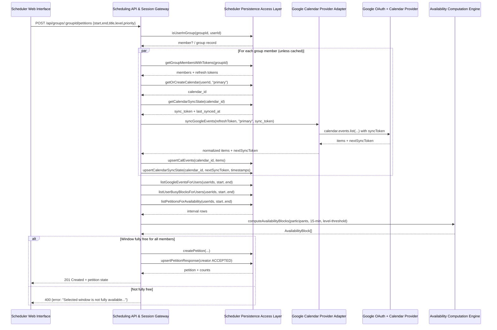
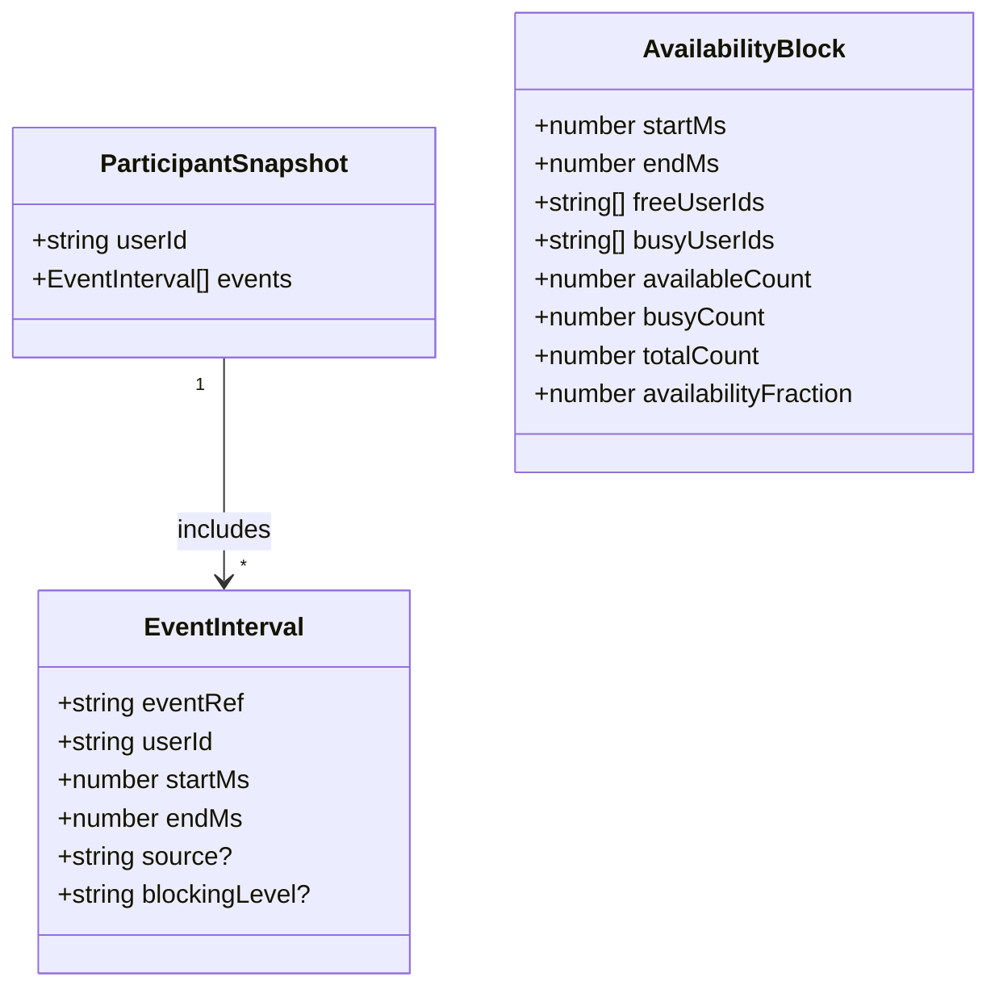
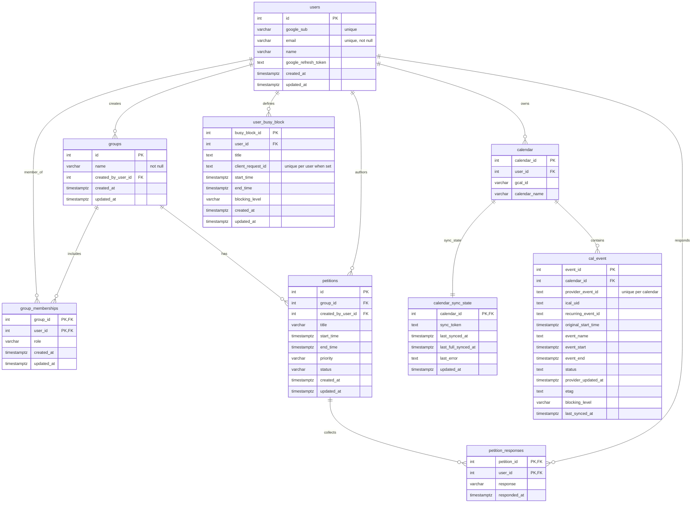

# Social Scheduler — Software Design Specification (SDS)

**Project:** Social Scheduler (experimentMVP)  
**Team:** Stella Greenvoss, David Haddad, Anna Norris, Garrett Caldwell  
**Revision:** Final (repository-verified)  
**Last updated:** February 11, 2026  

## 1. System Overview

**Authors:** Garrett Caldwell (original), repository-verified update by team — **February 11, 2026**

### 1.1 The Service

Social Scheduler helps small groups find meeting times by combining:

1. Google sign-in (OAuth 2.0) and Google Calendar access (read-only).
2. Group creation and membership management.
3. A shared “availability heatmap” computed over a requested time window and granularity.
4. A petition workflow for proposing a specific meeting block and collecting accept/decline responses.
5. User-managed “busy blocks” to intentionally mark additional time as unavailable (independent of Google Calendar events).

The system is deployed as a web application where the Scheduler Web Interface runs in a browser and communicates with a Scheduling API & Session Gateway over HTTP using JSON responses and cookie-based sessions.

### 1.2 System Organization

The system is organized as a modular web application with these main subsystems (renamed from the draft’s “Front-end” and “Back-end” to comply with Section 2.2 naming rules):

#### 1.2.1 Scheduler Web Interface

The Scheduler Web Interface is a browser-delivered HTML/CSS/JavaScript application (no framework required). It provides:

- Login initiation (“Login with Google”).
- Calendar View and Group View navigation.
- Group management (create group, list groups, view members, add members).
- Availability visualization for a selected group and time window.
- Petition creation and response actions.
- Busy-block creation, editing, and deletion.
- Per-event blocking-level edits for synced Google events.

#### 1.2.2 Scheduling Application Services

Scheduling Application Services run as a Node.js + Express application providing:

- Google OAuth login flow, session creation, and authenticated routing.
- REST endpoints for group management, availability computation, petitions, synced events, and busy blocks.
- A scheduling-oriented orchestration layer that:
  - Syncs Google events to the data store (incremental sync with caching),
  - Loads time-window event intervals from persistence,
  - Computes availability blocks via a dedicated algorithm module.

Repository-verified libraries used by this subsystem include Express (**4.18.2**), `pg` (**8.11.3**), `express-session` (**1.19.0**), `connect-pg-simple` (**10.0.0**), `googleapis` (**105.0.0**), and `dotenv` (**16.3.1**).

#### 1.2.3 Scheduler PostgreSQL Store

PostgreSQL persists user, group, petition, and busy-block data. In addition, **Google Calendar event metadata is persisted** (synced into `cal_event`) along with **incremental sync state** (`calendar_sync_state`). This corrects the draft statement that “The database will not store any Google Calendar event data.”

## 2. Software Architecture

**Authors:** Garrett Caldwell, Anna Norris, Stella Greenvoss (original), repository-verified update by team — **February 11, 2026**

### 2.1 Software Architecture

The architecture decomposes Social Scheduler into components that each have a single primary responsibility, allowing the scheduling experience to evolve independently (UI, orchestration/API, algorithm engine, persistence, and external provider integration).

#### 2.1.1 Software Components

Component list (static, high level):

1. **Scheduler Web Interface** — renders calendars and controls user actions.
2. **Scheduling API & Session Gateway** — Express app serving static UI assets and JSON endpoints; manages sessions.
3. **Google OAuth + Calendar Provider** (external) — OAuth authentication and calendar events source.
4. **Scheduler Persistence Access Layer** — PostgreSQL query/transaction utilities, CRUD for scheduler entities.
5. **Scheduler PostgreSQL Store** — persistent store for users, groups, petitions, busy blocks, calendars, and synced events.
6. **Google Calendar Provider Adapter** — wraps Google Calendar API calls and normalizes provider event payloads.
7. **Availability Computation Engine** — pure availability algorithm operating on transient interval snapshots.

Figure 1 shows how these components interact at a high level.

```mermaid
flowchart LR
  UI["Scheduler Web Interface\n(frontend/*)"] -->|HTTP(S) + JSON\n(cookie session)| API["Scheduling API & Session Gateway\n(backend/server.js)"]

  API --> DBAL["Scheduler Persistence Access Layer\n(backend/db/index.js)"]
  DBAL --> PG["Scheduler PostgreSQL Store\n(PostgreSQL)"]

  API --> ALG["Availability Computation Engine\n(backend/algorithm/*)"]

  API --> GCAL_ADAPTER["Google Calendar Provider Adapter\n(backend/services/googleCalendar.js)"]
  GCAL_ADAPTER --> GOOGLE["Google OAuth + Calendar Provider\n(googleapis)"]

  API -->|serves static assets| UI
```
Figure 1. System architecture showing major components and their primary communication paths.

#### 2.1.2 Components Interactions

Key interaction paths:

1. **Login and session creation**
   1. Scheduler Web Interface initiates `/auth/google`.
   2. Scheduling API & Session Gateway redirects to Google OAuth.
   3. Google OAuth returns an authorization code to `/oauth2callback`.
   4. Scheduling API exchanges the code for tokens, reads Google profile data, and upserts a user record.
   5. Scheduling API stores `userId` in a cookie-backed session and redirects to `/`.

2. **Group availability**
   1. Scheduler Web Interface requests `/api/groups/:groupId/availability?start=...&end=...&granularity=...&level=...`.
   2. Scheduling API validates membership and time window.
   3. Scheduling API (unless `NODE_ENV=test`) syncs calendars for group members with a 5-minute TTL cache.
   4. Scheduling API loads time-window intervals (synced events + busy blocks + accepted petitions) from PostgreSQL.
   5. Scheduling API calls the Availability Computation Engine and returns computed blocks.

3. **Petition creation and responses**
   1. Scheduler Web Interface submits a petition window.
   2. Scheduling API recomputes availability for the exact petition window and rejects non-fully-free windows.
   3. If valid, Scheduling API persists petition and responses and returns updated petition state.

#### 2.1.3 Rationale

The architecture separates concerns to maximize maintainability and enable parallel development:

- The Scheduler Web Interface can change visualizations and user interactions without impacting scheduling logic.
- The Availability Computation Engine is deliberately “pure” and unit-testable, allowing algorithm evolution without requiring a running database or Google access.
- Google Calendar integration is isolated behind the Google Calendar Provider Adapter, enabling future provider alternatives or mocking.
- Persistence is isolated in the Scheduler Persistence Access Layer, supporting schema evolution while keeping API routing logic readable.

### 2.2 Naming Conventions

**Authors:** Garrett Caldwell (original), repository-verified update by team — **February 11, 2026**

This SDS uses descriptive, project-specific module names. It intentionally avoids generic technical infrastructure names such as “Front end,” “Back end,” “Database,” “client,” or “server.”

Draft-to-final naming updates (examples):

- Draft “Front-end” → **Scheduler Web Interface**
- Draft “Back-end” → **Scheduling API & Session Gateway** and **Scheduling Application Services**
- Draft “Database” → **Scheduler PostgreSQL Store**
- Draft “Authentication” → **Google OAuth Session Manager** (implemented within the Scheduling API & Session Gateway)
- Draft “Calendar Retrieval” → **Google Calendar Provider Adapter** and **Google Calendar Synchronization Workflow**

## 3. Software Modules

**Authors:** Garrett Caldwell, Stella Greenvoss, Anna Norris (original), repository-verified update by team — **February 11, 2026**

This section lists and describes the system’s modules. Each module includes:

- Primary role and function
- Interface to other modules
- Static model
- Dynamic model
- Design rationale
- Alternative designs

### 3.1 Scheduler Web Interface (`frontend/*`)

#### 3.1.1 Primary role and function

The Scheduler Web Interface provides the user-facing scheduling experience:

1. Renders Calendar View and Group View.
2. Collects user input (time window selection, group selection, petition actions, busy-block edits).
3. Calls authenticated REST endpoints with `credentials: "include"` so the session cookie is sent.
4. Presents results (availability blocks, petitions, events, busy blocks) and drives UI state transitions.

#### 3.1.2 Interface to Other Modules

External software interface (HTTP endpoints consumed):

- `GET /api/me`
- `GET /api/groups`
- `POST /api/groups`
- `GET /api/groups/:groupId/members`
- `POST /api/groups/:groupId/members`
- `DELETE /api/groups/:groupId`
- `GET /api/groups/:groupId/availability`
- `GET /api/groups/:groupId/petitions`
- `POST /api/groups/:groupId/petitions`
- `GET /api/petitions`
- `POST /api/petitions/:petitionId/respond`
- `DELETE /api/petitions/:petitionId`
- `POST /api/google/sync`
- `GET /api/events`
- `POST /api/events/:eventId/priority`
- `GET /api/busy-blocks`
- `POST /api/busy-blocks`
- `POST /api/busy-blocks/:busyBlockId`
- `DELETE /api/busy-blocks/:busyBlockId`

#### 3.1.3 Static model

The module is organized as static assets and ES modules:

- Pages: `index.html`, `login.html`, `error.html`
- API wrapper: `js/api/api.js` (`apiGet`, `apiPost`, `apiDelete`)
- Auth helper: `js/auth.js` (`getCurrentUser`)
- View controllers:
  - `js/calendar/calendarController.js` (Calendar View orchestration)
  - `js/groups/groupsView.js` (Group View orchestration)
  - rendering utilities in `js/calendar/*Render*.js`

#### 3.1.4 Dynamic model

1. On load, `js/main.js` calls `getCurrentUser()` (via `/api/me`).
2. If unauthenticated, the browser is redirected to `/login`.
3. In Calendar View, the UI loads:
   - synced events (`/api/events`),
   - busy blocks (`/api/busy-blocks`),
   - user petitions (`/api/petitions`).
4. In Group View, the UI loads:
   - groups (`/api/groups`),
   - group members (`/api/groups/:groupId/members`),
   - group availability (`/api/groups/:groupId/availability`),
   - group petitions (`/api/groups/:groupId/petitions`),
   and provides petition response actions.

#### 3.1.5 Design rationale

The web interface is kept lightweight (HTML/CSS/JS) to reduce tooling overhead and keep iteration fast. A small API wrapper standardizes authenticated fetch calls and minimizes duplication.

#### 3.1.6 Alternative designs

Alternatives considered:

- Single-page framework (React/Vue/Svelte) for state management. Rejected for MVP to minimize build tooling and dependency surface.
- Server-side rendering for all pages. Rejected because most UI interactions are driven by dynamic scheduling data that is more naturally handled in browser-side JavaScript for this MVP.

### 3.2 Scheduling API & Session Gateway (`backend/server.js`)

#### 3.2.1 Primary role and function

This module is the system’s HTTP entry point and orchestration layer. It:

1. Serves static Scheduler Web Interface assets.
2. Manages cookie-based sessions using `express-session` + `connect-pg-simple`.
3. Implements Google OAuth login and user session creation.
4. Exposes REST endpoints for groups, availability, petitions, Google sync, events, and busy blocks.
5. Coordinates multi-step workflows (e.g., sync → query persisted intervals → compute availability → validate petition → persist petition).

Corrected behavior vs. draft:

- The draft described a “new user is asked to create a valid username.” **No separate username creation step exists**; the system derives a display name from the Google profile and stores it in `users.name`.
- The draft described calendar events as transient-only. **Google events are synced and stored** in PostgreSQL (`cal_event`) and refreshed incrementally.

#### 3.2.2 Interface to Other Modules

Interfaces provided:

1. HTTP endpoints (selected key specifications):
   - `GET /api/me` → `{ id, email, name }` (requires session).
   - `POST /api/groups` with `{ name }` → `group` (requires session).
   - `GET /api/groups/:groupId/availability` with query params:
     - `start`, `end` (ISO 8601 string or epoch ms)
     - optional `granularity` (minutes)
     - optional `level` (`AVAILABLE|FLEXIBLE|MAYBE`; affects filtering threshold)
     → returns `AvailabilityBlock[]`.
   - `POST /api/groups/:groupId/petitions` with `{ start, end, title?, level?, priority? }`:
     - requires 15-minute block alignment for `start` and `end`
     - validates window is fully free for all members
     → returns petition + counts.
   - `POST /api/petitions/:petitionId/respond` with `{ response: "ACCEPT"|"DECLINE" }` → updated petition state.
   - `POST /api/google/sync` with `{ calendarId?, force? }` → sync summary.
   - `POST /api/busy-blocks` with `{ startMs, endMs, title?, clientRequestId, blockingLevel? }` → upsert-like result.
   - `POST /api/events/:eventId/priority` with `{ blockingLevel: "B1"|"B2"|"B3" }` → updated event row.

2. Internal interfaces used:
   - Scheduler Persistence Access Layer (`backend/db/index.js`) function calls for all persistence operations.
   - Google Calendar Provider Adapter (`backend/services/googleCalendar.js`) to perform provider sync and normalize event payloads.
   - Availability Computation Engine (`backend/algorithm/index.cjs`) via `computeAvailabilityBlocks(args)`.

#### 3.2.3 Static model

Key internal data contracts (as used by orchestration):

- Session state:
  - `req.session.userId` (authenticated user)
  - `req.session.state` (OAuth CSRF state during login)
- Availability inputs:
  - `ParticipantSnapshot[]` where each participant has `userId` and `EventInterval[]`.
- Blocking levels:
  - `B1` = strict (treat more events as blocking)
  - `B2` = medium
  - `B3` = lenient (default; fewer intervals included when filtering)

#### 3.2.4 Dynamic model

Sequence for the most complex workflow: petition creation (compute + validate + persist).

Figure 2 illustrates the end-to-end petition creation workflow.


Figure 2. Petition creation workflow: sync (when needed), load persisted intervals, compute availability, validate, then persist petition state.

#### 3.2.5 Design rationale

Keeping orchestration in a single API module makes request validation, authentication, and workflow coordination easy to audit and test. The design also enables “pure” scheduling logic to be pushed into the algorithm module, which improves testability and reduces coupling to persistence and provider concerns.

#### 3.2.6 Alternative designs

Alternatives considered:

- Stateless JWT authentication. Rejected for MVP; cookie sessions simplify browser integration and allow server-side session invalidation.
- Computing availability directly in SQL. Rejected due to complexity of interval merging and per-user filtering by blocking level; the dedicated algorithm module is clearer and easier to test.
- On-demand provider fetch for every availability request. Initially considered in the draft, but replaced with **incremental sync + database-backed caching** to reduce API latency and provider rate-limit risk.

### 3.3 Scheduler Persistence Access Layer (`backend/db/index.js`)

#### 3.3.1 Primary role and function

This module provides all PostgreSQL access for the application:

1. Connection pooling (`pg.Pool`) with production TLS settings.
2. Schema initialization and migrations (`runSchemaMigrations`).
3. CRUD and query functions for users, groups, petitions, calendars, events, and busy blocks.
4. Transactional “upsert” workflows (e.g., `upsertUserFromGoogle`, `upsertCalEvents`, `createUserBusyBlock` with idempotency key enforcement).

#### 3.3.2 Interface to Other Modules

Primary interface is its exported functions, called by the Scheduling API & Session Gateway. Key functions include:

- Users: `upsertUserFromGoogle`, `getUserById`, `getUserByEmail`
- Groups: `createGroup`, `listGroupsForUser`, `getGroupById`, `isUserInGroup`, `addGroupMemberWithLimit`, `getGroupMembersWithTokens`, `deleteGroup`
- Petitions: `createPetition`, `listGroupPetitions`, `listUserPetitions`, `upsertPetitionResponse`, `getPetitionResponseCounts`, `updatePetitionStatus`, `deletePetition`, `listPetitionsForAvailability`
- Calendars/events: `getOrCreateCalendar`, `getCalendarSyncState`, `upsertCalendarSyncState`, `upsertCalEvents`, `markCalEventsCancelled`, `listGoogleEventsForUser(s)`, `updateGoogleEventBlockingLevel`
- Busy blocks: `createUserBusyBlock`, `listUserBusyBlocks(ForUsers)`, `updateUserBusyBlock`, `deleteUserBusyBlock`

#### 3.3.3 Static model

The module implements a repository-style interface:

- One PostgreSQL pool used across the application.
- SQL queries that map 1:1 to domain operations (user/group/petition/calendar/event/busy-block).
- Schema management function executes `table_initialization.sql` + `priority_migrations.sql` as a guarded, idempotent startup step.

#### 3.3.4 Dynamic model

Typical request lifecycle for persistence:

1. Scheduling API receives an HTTP request and validates inputs.
2. Scheduling API calls one or more DB functions (some within a transaction).
3. DB module returns rows mapped to JSON-friendly structures.
4. Scheduling API composes response payloads and returns them to the Scheduler Web Interface.

#### 3.3.5 Design rationale

Centralizing SQL access:

- Reduces duplicated SQL across the project.
- Encapsulates schema evolution (migrations, type widening, legacy backfills).
- Improves security by minimizing the number of places that build SQL strings and handle credentials.

#### 3.3.6 Alternative designs

Alternatives considered:

- ORM (Prisma/Sequelize). Rejected for MVP to keep schema and queries explicit and minimize dependency weight.
- Multiple DB modules split by domain. Deferred; the current size is manageable, and a single module simplifies shared transaction patterns.

### 3.4 Scheduler PostgreSQL Schema & Migrations (`backend/db/*.sql`)

#### 3.4.1 Primary role and function

This module defines the persistent data model and integrity constraints for:

- User identity and OAuth metadata.
- Groups and memberships.
- Petitions and responses.
- Calendar mapping, incremental sync state, and synced event records.
- User-defined busy blocks.

#### 3.4.2 Interface to Other Modules

The schema is consumed by:

- Scheduler Persistence Access Layer (`backend/db/index.js`) queries and migrations.
- Session storage middleware (`connect-pg-simple`) which creates/uses a `session` table.

#### 3.4.3 Static model

The schema is defined in:

- `table_initialization.sql` (base tables + constraints)
- `priority_migrations.sql` (idempotent upgrades: sync state, busy blocks, cal_event provider fields and constraints)

#### 3.4.4 Dynamic model

1. On startup (and in test/setup), the persistence layer runs schema initialization and migrations.
2. Domain operations use constraints to enforce correctness (e.g., unique calendar-per-user, petition status checks, time ordering checks).
3. Incremental sync updates `calendar_sync_state` and upserts `cal_event` records over time.

#### 3.4.5 Design rationale

Schema-first SQL provides:

- Clear data ownership boundaries.
- Strong referential integrity via foreign keys and `ON DELETE CASCADE` where appropriate.
- Evolvable design through guarded, idempotent migrations suitable for MVP deployments.

#### 3.4.6 Alternative designs

Alternatives considered:

- No persistence for provider events (draft assumption). Rejected in the current implementation because incremental sync and caching reduce provider calls and allow consistent group availability computation.
- Storing full provider payload blobs (JSON). Rejected for MVP; the schema stores only fields required for scheduling computation and auditability.

### 3.5 Google Calendar Provider Adapter (`backend/services/googleCalendar.js`)

#### 3.5.1 Primary role and function

This module provides the Google Calendar integration boundary:

1. Builds an OAuth client from environment variables.
2. Lists events in a time window (for one-off reads).
3. Performs incremental sync using Google’s sync tokens (with expiration detection).
4. Normalizes provider event payloads into internal interval-friendly records.

#### 3.5.2 Interface to Other Modules

Exports:

- `listGoogleEvents({ refreshToken, timeMin, timeMax })`
- `syncGoogleEvents({ refreshToken, calendarId, syncToken })`
- `normalizeEventsToIntervals(events, userId)`
- `fetchBusyIntervalsForUser({ userId, refreshToken, windowStartMs, windowEndMs })`

Used by:

- Scheduling API & Session Gateway to sync and normalize events for persistence and scheduling.

#### 3.5.3 Static model

Key normalized fields:

- `providerEventId` (Google event `id`)
- `iCalUID`, `recurringEventId`, `originalStartTime` (where available)
- event time bounds (converted to epoch ms or ISO timestamps at boundaries)

#### 3.5.4 Dynamic model

1. Scheduling API provides a refresh token and optionally a sync token.
2. Adapter calls `calendar.events.list` repeatedly (paging).
3. Adapter returns `{ items, nextSyncToken, fullSync }`.
4. Scheduling API stores/upserts event records and sync state.

#### 3.5.5 Design rationale

Isolating provider calls:

- Keeps third-party API details out of orchestration code.
- Makes it feasible to mock provider behavior in tests.
- Enables future support for additional calendar providers without rewriting the API layer.

#### 3.5.6 Alternative designs

Alternatives considered:

- Direct provider calls in request handlers. Rejected because it would intertwine provider behavior with HTTP routing and complicate testing.
- Background job/queue for sync. Deferred for MVP; on-demand sync with TTL caching is sufficient for expected load.

### 3.6 Availability Computation Engine (`backend/algorithm/*`)

#### 3.6.1 Primary role and function

This module computes availability blocks over a window by:

1. Accepting a list of participants, each with event intervals.
2. Filtering intervals by a “minimum blocking level” threshold (`B1`, `B2`, `B3`).
3. Clamping and merging overlapping intervals per participant.
4. Iterating over fixed-size blocks (default 15 minutes) and counting “free vs busy” participants.
5. Outputting an ordered list of availability blocks with `availabilityFraction` and participant IDs.

#### 3.6.2 Interface to Other Modules

Exports:

- `computeAvailabilityBlocks({ windowStartMs, windowEndMs, participants, granularityMinutes?, priority? })`

Input/Output contracts:

- Inputs use types defined in `types/algorithm_types.js`: `ParticipantSnapshot`, `EventInterval`.
- Output is an array of `AvailabilityBlock`.

Used by:

- Scheduling API & Session Gateway via `backend/algorithm/index.cjs`.

#### 3.6.3 Static model

Figure 3 summarizes the core data structures used by the availability algorithm.


Figure 3. Core data structures used by the Availability Computation Engine.

#### 3.6.4 Dynamic model

1. For each participant, the engine clamps events to `[windowStartMs, windowEndMs)` and filters by blocking threshold.
2. It merges overlapping intervals for that participant into a minimal interval set.
3. For each time block, it checks whether each participant is busy (interval overlap) or free.
4. It emits an `AvailabilityBlock` with counts and lists of free/busy user IDs.

#### 3.6.5 Design rationale

The engine is designed to be “pure” (no DB/provider calls) so it can be:

- Unit tested deterministically.
- Reused across different orchestration strategies (live provider fetch vs cached persistence).
- Optimized independently (e.g., improved interval scanning) without changing API routing or schema.

#### 3.6.6 Alternative designs

Alternatives considered:

- Compute free-time intervals directly (instead of block-based heatmap). Rejected for MVP visualization needs; block-based output maps cleanly to a calendar grid.
- Storing computed availability in PostgreSQL. Rejected because availability depends on query window, granularity, and blocking threshold, making caching complex and potentially stale.

### 3.7 Remote Database Initialization Utility (`backend/init_remote_db.js`)

#### 3.7.1 Primary role and function

This utility initializes a remote PostgreSQL database by applying:

1. `backend/db/table_initialization.sql`
2. `backend/db/priority_migrations.sql`

It also performs a legacy upgrade for `cal_event` provider identifiers.

#### 3.7.2 Interface to Other Modules

This module is a developer/operator utility and is not invoked by the runtime system. It depends on:

- `pg.Client`
- local SQL files under `backend/db/`

#### 3.7.3 Static model

Inputs:

- A PostgreSQL connection string (currently embedded in the script).
- SQL schema and migration files.

Outputs:

- Initialized/updated schema in the target database.

#### 3.7.4 Dynamic model

1. Connect to PostgreSQL with TLS.
2. Execute schema + migrations.
3. If a legacy `cal_event.gcal_event_id` column exists, backfill `provider_event_id` and drop the legacy column.
4. Exit with success or error logs.

#### 3.7.5 Design rationale

Providing a standalone initializer simplifies first-time deployment and recovery (e.g., setting up Render PostgreSQL) without requiring the full application server to be running.

#### 3.7.6 Alternative designs

Alternatives considered:

- Rely on application startup to run migrations only. Kept as well, but the standalone utility provides an operator-friendly option.
- Use a dedicated migration framework. Deferred for MVP; idempotent SQL plus a small runner is sufficient.

### 3.8 OAuth Diagnostics Utilities (`backend/oauth-test/*`, `homepage_authredirect/*`, `oauth-test/*`)

#### 3.8.1 Primary role and function

These utilities support debugging OAuth redirects and API calls during development. They are not required for the production scheduling workflow.

#### 3.8.2 Interface to Other Modules

Standalone HTML/JS scripts and small Node.js servers that may call Google OAuth endpoints or the Scheduling API during development.

#### 3.8.3 Static model

- Test pages and scripts for validating redirect configuration and request formatting.

#### 3.8.4 Dynamic model

- Developer runs the utility, observes redirects and responses, and adjusts configuration accordingly.

#### 3.8.5 Design rationale

Keeping diagnostics separate from the runtime scheduler reduces risk of mixing debug behavior with production logic.

#### 3.8.6 Alternative designs

- Remove utilities after development. Deferred; keeping them aids reproducibility and future troubleshooting.

### 3.9 Snapshot Update Utility (`scripts/update_snapshot.sh`, `vendor/stellas_snapshot/*`)

#### 3.9.1 Primary role and function

This utility supports maintaining a vendor snapshot for comparison/backup during development.

#### 3.9.2 Interface to Other Modules

Developer-only utility; it is not required for runtime behavior.

#### 3.9.3 Static model

Shell script that updates snapshot content under `vendor/stellas_snapshot/`.

#### 3.9.4 Dynamic model

Developer runs the script to refresh the snapshot.

#### 3.9.5 Design rationale

Snapshots can help recover from destructive changes and enable quick diffs during rapid MVP iteration.

#### 3.9.6 Alternative designs

- Rely solely on Git history. Typically sufficient, but a snapshot provides a lightweight “known-good” baseline in some workflows.

### 3.10 Event Management Reference Library (`backend/algorithm/event_management/*`)

#### 3.10.1 Primary role and function

This module is a self-contained reference implementation for event-management logic with test coverage. It is primarily used for development/testing and is not required for the deployed scheduling workflow.

#### 3.10.2 Interface to Other Modules

- Exported via `backend/algorithm/event_management/index.js` and `backend/algorithm/event_management/index.cjs` for consumption within the algorithm package’s test suite.
- Not invoked by `backend/server.js` in the current repository.

#### 3.10.3 Static model

The library is organized as a small set of cooperating units (kept separate to improve testability):

- A controller unit coordinating operations.
- A storage/model unit maintaining in-memory event records.
- A view/formatting unit for rendering/transforming outputs.

#### 3.10.4 Dynamic model

1. A caller creates/configures the module via its factory/index entry.
2. The caller submits event operations (create/update/delete).
3. The controller updates the model store and returns a formatted result.

#### 3.10.5 Design rationale

Keeping this library independent provides a safe place to validate design patterns and scheduling-adjacent logic with high automated coverage, without coupling it to the production API module.

#### 3.10.6 Alternative designs

- Remove the library once no longer needed. Deferred because it remains useful for regression testing and design experiments.

### 3.11 ICS Availability Test Toolkit (`backend/algorithm/AI_ics_test/*`)

#### 3.11.1 Primary role and function

This toolkit supports generating and evaluating `.ics` calendars for algorithm experimentation (e.g., building availability from ICS inputs). It is not required for production runtime behavior.

#### 3.11.2 Interface to Other Modules

Standalone scripts and data files executed by developers; not invoked by `backend/server.js`.

#### 3.11.3 Static model

- Script files (`*.mjs`) that generate or process ICS content.
- Sample calendars (`*.ics`) used as fixtures.

#### 3.11.4 Dynamic model

1. Developer runs a toolkit script.
2. The script loads sample ICS data and produces derived availability artifacts or test outputs.

#### 3.11.5 Design rationale

ICS-driven experiments provide a repeatable way to test scheduling logic without requiring live Google accounts.

#### 3.11.6 Alternative designs

- Replace with exclusively unit-test-driven fixtures. Deferred; the toolkit is useful for exploratory testing and demonstrations.

### 3.12 Automated Verification Suite (`backend/__tests__/*`, `backend/algorithm/*.test.js`)

#### 3.12.1 Primary role and function

The automated verification suite checks correctness of scheduling behaviors, database constraints, and key workflows using Jest-based tests.

#### 3.12.2 Interface to Other Modules

Invoked via:

- `npm test` in `backend/`
- `npm test` in `backend/algorithm/`

#### 3.12.3 Static model

- Backend tests cover API routes, constraint behavior, and availability/petition flows.
- Algorithm tests cover the pure computation engine and reference libraries.

#### 3.12.4 Dynamic model

1. Test runner initializes schema (or uses a test database).
2. Tests call module functions and/or HTTP endpoints with mocked sessions/provider interactions as needed.
3. Assertions validate outputs and database state transitions.

#### 3.12.5 Design rationale

Automated tests reduce regression risk while the scheduling logic and schema evolve and support safe refactoring of the computation engine and orchestration code.

#### 3.12.6 Alternative designs

- Manual-only validation. Rejected; scheduling logic is prone to subtle time-window edge cases and benefits strongly from automation.

### 3.13 Snapshot Bootstrap Script (`import_test.sh`)

#### 3.13.1 Primary role and function

This script bootstraps the snapshot tooling by creating `scripts/update_snapshot.sh` and the `vendor/` snapshot directory structure.

#### 3.13.2 Interface to Other Modules

Developer-only utility; it is not invoked by runtime components. It:

- Writes `scripts/update_snapshot.sh`.
- Creates `scripts/` and `vendor/` directories if needed.

#### 3.13.3 Static model

- Shell script containing a here-document that writes another shell script.

#### 3.13.4 Dynamic model

1. Developer runs `import_test.sh`.
2. The script creates/overwrites `scripts/update_snapshot.sh`.
3. The developer can then run `scripts/update_snapshot.sh` to refresh `vendor/stellas_snapshot/`.

#### 3.13.5 Design rationale

It provides a repeatable way to reconstruct snapshot tooling without manual copy/paste.

#### 3.13.6 Alternative designs

- Remove the bootstrap script and commit `scripts/update_snapshot.sh` directly. Deferred; the current approach keeps snapshot tooling easy to regenerate.

## 4. Alternative Designs

**Authors:** Team — **February 11, 2026**

Architecture-level alternatives considered:

1. **Provider events not persisted** (draft assumption): Fetch all Google events on every availability request and discard them.
   - Rejected in the current implementation in favor of **incremental sync + database-backed caching**, which reduces repeated provider calls, improves latency, and supports consistent group computations.

2. **Background synchronization worker**: A queue/cron-style worker continuously syncs calendars independent of user requests.
   - Deferred for MVP. The current design syncs on demand with a TTL cache.

3. **Unified “event” table**: Store Google events, busy blocks, and petitions in one polymorphic table.
   - Rejected for clarity and normalization; separate tables keep constraints and ownership clear.

4. **Real-time updates via WebSockets**: Push petition updates to all members instantly.
   - Deferred for MVP. The current interface polls/refreshes via REST calls.

## 5. Database Design

**Authors:** Stella Greenvoss (original), repository-verified update by team — **February 11, 2026**

The Scheduler PostgreSQL Store is designed to be in **third normal form (3NF)**:

- Each table represents a single concept (user, group, membership, petition, response, calendar, event, sync state, busy block).
- Many-to-many relationships are represented by join tables (`group_memberships`, `petition_responses`).
- Non-key attributes depend only on the key and not on other non-key attributes (e.g., a petition response depends on `(petition_id, user_id)`).

Figure 4 shows the ER diagram of the repository-defined schema.


Figure 4. Entity-relationship diagram of the repository-defined PostgreSQL schema (base schema + migrations).

Notes:

- Session persistence uses a `session` table created/managed by `connect-pg-simple` (schema owned by that library).
- The database stores Google refresh tokens (`users.google_refresh_token`). Production deployments must treat this column as sensitive PII/secret material.

## 6. References

IEEE Std 1016-2009. *IEEE Standard for Information Technology—Systems Design—Software Design Descriptions*. https://ieeexplore.ieee.org/document/5167255  
Parnas, D. L. (1972). *On the criteria to be used in decomposing systems into modules*. Commun. ACM, 15(12), 1053–1058.  
Faulk, S. (2017). Software architecture definition cited in template guidance.  
Google Calendar API (v3). https://developers.google.com/calendar/api/v3/reference/events/list  
OAuth 2.0 (Google Identity). https://developers.google.com/identity/protocols/oauth2  
Mermaid Diagramming and Charting. https://mermaid.js.org/

## 7. Acknowledgments

The construction of the original module decomposition draft was generated with assistance from ChatGPT. The final architecture and module set in this SDS represents meaningful deviation from that early draft and was updated by verifying the current repository implementation.
